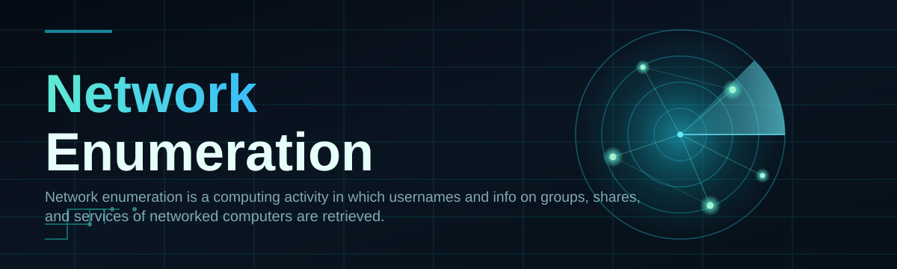
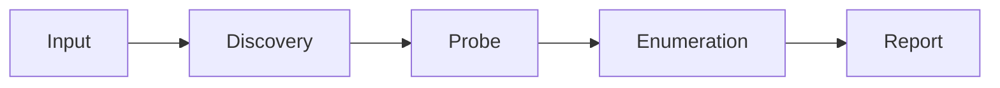

# network-scanner-tool 🛰️🔎

  

*Point it at a network, get back every host, share, service, and identity hiding in it — no fuss, no bloat.*

  

## 🧭 Overview

**network-scanner-tool** is a standalone Windows utility built for **network enumeration** — the process of walking a live network and pulling back the details that actually matter: hostnames, usernames, group membership, exposed shares, and running services. This is a deliberately different animal from simple network mapping. Mapping tells you *what's connected and what OS it runs*. Enumeration goes deeper — it knocks on the doors that respond, asks the polite protocol questions (ICMP, SNMP, and friends), and comes back with a structured picture of who and what lives on each node.

This project exists because most "network scanner" tools out there are either bloated enterprise suites that need a server farm to install, or half-finished scripts that die the moment a subnet has more than 50 hosts. We built this as a solo-dev, ships-fast alternative: a single executable that does the enumeration job properly, surfaces the data in a UI that doesn't require a manual, and gets out of your way.

It's built for **sysadmins auditing their own infrastructure**, **IT consultants doing network discovery on a new client site**, **students learning how enumeration protocols actually behave**, and **home-lab tinkerers** who want to know exactly what's talking on their network. If you need fast, reliable visibility into hosts, shares, groups, and services — this is the tool.

> [!NOTE]
> This tool is intended for scanning networks you own, administer, or have explicit permission to assess. Treat every scan like an audit — because that's exactly what it is.

---

## ⚡ What It Actually Does

> [!IMPORTANT]
> This is **NOT** a topology mapper, a bandwidth monitor, or a packet sniffer. It does not draw pretty network diagrams for their own sake, and it does not capture or inspect payload traffic. What it **does** do is answer the question: *"who and what is actually reachable on this network, right now?"*

- **Host Discovery** — Sweeps the target range using ICMP and ARP-style probing to build a live inventory of responsive devices, fast.

- **Service Fingerprinting** — Scans well-known ports on discovered hosts to identify what's actually running: file servers, print services, remote access, and more.

- **Share & Resource Listing** — Enumerates exposed network shares per host so you can see what's actually accessible before someone else finds it first.

- **User & Group Enumeration** — Pulls back visible usernames and group membership info where the network exposes it, giving you a real picture of identity sprawl.

- **SNMP Walkthrough** — Queries SNMP-enabled devices for system details, uptime, and configuration data without needing a separate MIB browser.

- **Zero-Dependency Runtime** — One executable, no installer, no background services left behind. Run it, use it, close it.

- **Structured Export** — Every scan result can be exported to a clean, structured format for reporting or feeding into other tools.

- **Session History** — Keeps a local log of past scans so you can diff network state over time and catch drift early.

---

## 🚀 Getting Started

1. **Visit the landing page** using the download button above — that's the only source for builds.

2. **Download the latest build** for Windows 10/11 (x64).

3. **Run the executable** — no installer wizard, no admin prompts unless a specific enumeration method requires elevated privileges.

4. **Enter your target range** (single IP, CIDR block, or hostname list) and hit scan.

> [!TIP]
> Start with a small subnet (`/28` or smaller) on your first run to get a feel for scan timing before you point it at a full `/16`.

---

## 🖥️ System Requirements

| Component | Minimum |
|---|---|
| OS | Windows 10 (64-bit) or Windows 11 |
| RAM | 4 GB |
| Disk | 150 MB free |
| Network | Active LAN/WLAN adapter |
| Dependencies | None — fully standalone |
| Admin rights | Only needed for select deep-enumeration modes |

---

## 🧩 How It Works

The tool runs a straightforward, predictable pipeline every time — no black-box magic, no phone-home telemetry deciding your scan behavior.

1. **Target Resolution** — Input is parsed into a concrete list of IPs to probe.

2. **Discovery Sweep** — Overt discovery protocols (ICMP, ARP, SNMP) identify which hosts are alive.

3. **Service & Port Probe** — Live hosts get checked against a well-known port and service signature list.

4. **Enumeration Pass** — Shares, groups, and usernames are pulled from hosts that expose them.

5. **Report Assembly** — Results are compiled into a browsable, exportable session.

---

## 🛠️ Troubleshooting

**Q: My scan returns zero hosts on a network I know is active.**
A: Check that ICMP isn't blocked at the router/firewall level — some networks silently drop ping requests. Try enabling the ARP-based fallback discovery mode.

**Q: Enumeration finds hosts but no shares or usernames.**
A: This usually means the target hosts have tightened anonymous access. That's actually a good security sign for that network — enumeration only surfaces what's exposed.

**Q: The scan is slow on large subnets.**
A: Reduce concurrent thread count in settings if your network gear chokes on parallel probes, or narrow the CIDR range per scan.

**Q: SNMP queries return nothing.**
A: Confirm the target device has SNMP enabled and that you're using the correct community string in settings — default community strings are attempted first.

**Q: Windows flags the executable on first run.**
A: This is standard for new, unsigned standalone tools. Verify the download came from the official landing page linked above before proceeding.

**Q: Can I scan across VLANs?**
A: Only if routing between VLANs is permitted at the network layer — the tool respects existing routing, it doesn't tunnel around it.

---

## 🎨 UI / UX Details

- **Themes** — Light and Dark, switchable from Settings without a restart.

- **Keyboard Shortcuts**:

  | Shortcut | Action |
  |---|---|
  | `Ctrl+N` | New scan |
  | `Ctrl+E` | Export current results |
  | `Ctrl+H` | View scan history |
  | `F5` | Re-run last scan |
  | `Esc` | Cancel active scan |

- **Live Results Pane** — Hosts populate in real time as they respond, no waiting for the full sweep to finish before you see anything.

<strong>Advanced settings you probably want to tweak</strong>

- Thread/concurrency cap for probe speed vs. network load
- Custom port lists for service fingerprinting
- SNMP community string presets
- Timeout thresholds per probe type
- Auto-export on scan completion

> [!WARNING]
> Cranking concurrency to maximum on older switches or IoT-heavy networks can cause hiccups on flaky hardware. Ease into it.

---

## 🤝 Contributing & Community

This is a solo-dev project that ships fast and stays lean — but outside input is welcome. Bug reports, feature requests, and pull requests are all reviewed directly.

- Open an issue with a clear repro (target network type, OS build, expected vs actual).

- Fork, branch, and submit PRs against `main` — keep changes focused and scoped.

- Discussions tab is the place for feature ideas and general network-enumeration talk.

> [!TIP]
> If you're contributing enumeration logic for a new protocol, include a short note on which RFC or vendor spec it follows — makes review much faster.

  

---

## 📜 License

Released under the [MIT License](LICENSE), 2026. Use it, fork it, ship it — just keep the license notice intact.

---

## ⚖️ Disclaimer

> [!IMPORTANT]
> **network-scanner-tool** is built strictly for legitimate network administration, auditing, and educational purposes. Only run it against networks and devices you own or are explicitly authorized to assess. The maintainers assume no liability for misuse. Enumeration is a powerful diagnostic capability — treat it with the same care you'd give any admin-level tool.

---

